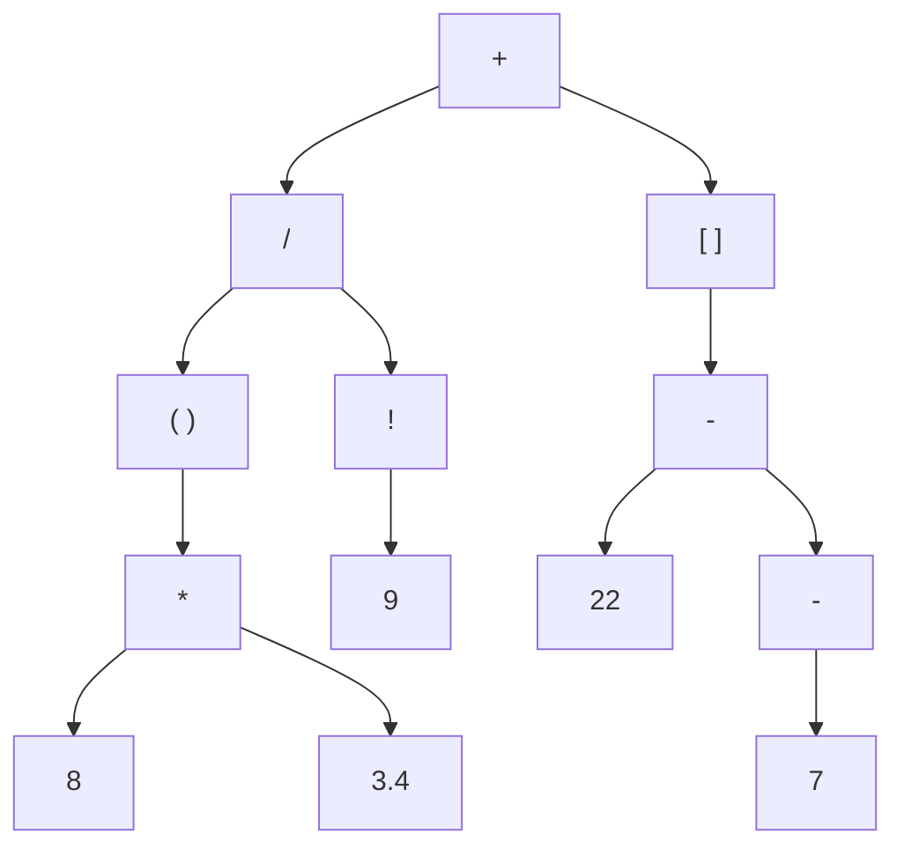

# Contents

- [Overview](#overview)
- [Build Instructions](#build-instructions)
- [Grammar](#grammar)
- [Implementation Details](#implementation-details)
    - [Tokens](#tokens)
    - [The Lexer](#lexer)
    - [Expressions](#expressions)
    - [The Parser](#parser)
    - [Error Handling](#error-handling)
    - [Logging](#logging)
- [TODO](#todo)

# Overview
Welcome! This project demonstrates an expression compiler implemented using modern C++ features (C++20). Currently, the program is capable of the following:

- Tokenizing an input string provided by either a file (`../data/code.txt` by default; change this location in `src/settings.hpp`) or through macro expansion (modify `MANUAL_INPUT_STR` accordingly and set `INPUT_METHOD` to `FILE_INPUT` in `src/main.cpp`).
- Producing an abstract syntax tree (AST) and printing its contents in normal Polish notation (NPN).

A multitude of test cases are provided to verify both the lexer's and the parser's functionality. See [Build Instructions](#build-instructions) for more information.

# Build Instructions
The build was officially tested against the LLVM (clang64) and GNU (ucrt64) toolchains provided by MSYS2. Successful compilation on Linux systems is not guaranteed but highly probable.

## Requirements
The following software is required to successfully build the program:

- VCPKG
- CMake
- Ninja or Make

***DO NOT PUSH UNTIL YOU HAVE ADDED THE REQUIRED TEST CASES TO THE PROJECT AND FINISHED THE INSTRUCTIONS FOR THIS SECTION! Just list a command series for Windows and figure out a way to build tests and the actual program separately.***

# Grammar
Valid input expressions abide by the following rules:

| Operator | Operation           | Precedence                       |
| -------- | ------------------- | -------------------------------- |
| +        | Addition            | Term                             |
| -        | Subtraction         | Term & Unary (Right Associative) |
| *        | Multiplciation      | Factor                           |
| /        | Division            | Factor                           |
| !        | Factorial Expansion | Unary (Left Associative)         |

- Precedence:
    - expression &rarr; term
    - term &rarr; factor
    - factor &rarr; unary (right associative)
    - unary (right associative) &rarr; unary (left associative)
    - unary (left associative) &rarr; primary

- Additional Rules:
    - Whitespace is ignored. However, tokens comprising multiple characters must not contain any
    - Double-precision numbers may start with or end with a separator, but each must have at least one explicit accompanying digit and they may not contain more than one separator
    - Numeric tokens must be separated by whitespace
    - Distribution without an explicit `*` is currently unsupported

# Implementation Details
This section provides an overview of the project's implementation. While it does not cover every function and/or line of code, it serves to underscore important design decisions and considerations that ultimately made their way to the most recent commit.

## Tokens
Tokens are the fundamental unit for storing expression data in the compilation pipeline. Inevitably, all `Token` instances have two populated fields: `type` (`Token::Type`) and `literal` (`Literal`). `Literal` is an aliased type:

    // Token.hpp
    using Literal = std::variant<char, int, double>;

`type` serves as the primary differentiator of tokens throughout the pipeline. When the active parser needs to match tokens at certain precedence levels or the lexer needs to distinguish betwewen numeric types, it uses this field to do so.

A few associated member functions are defined to extend the functionality of `Token` in certain contexts. The following methods will not be covered, as their declarations should suffice:

    // Token.hpp
    struct Token {
        ...

        struct ToString {
            static std::string Type(const Token::Type type);
        };

        explicit operator bool() const;
        bool operator==(const Token& other) const;
        friend std::ostream& operator<<(std::ostream& out, const Token& token);

        ...
    };

Most tokens implementations include an additional field: the lexeme. While literals represent the underlying data, lexemes provide a textual representation of data. The additional field is unnecessary for this project, however, as the overloaded insertion operator (`<<`) already handles piping raw data to streams.

## Lexer
The lexer handles the tokenization stage of the overall pipeline. It is initialized by passing a value string (for unified control over move semantics and copy construction) or a path to the input file (via `std::filesystem::path`).

The public interface exposes two useful methods: `tokenize` and `printTokens`. Both methods do exactly what one would expect, with the caveat that `tokenize` updates the state of the active `Lexer` object. Any attempts to print an empty lexer or one whose state is not `OKAY` will have no effect.

    // Lexer.hpp
    std::pair<std::vector<Token>, bool> tokenize();
    bool tokenize(std::vector<Token>& tokens);
    void printTokens(const std::vector<Token>& tokens, std::size_t right_just) const;

You can customize where the actual token values appear (relative to the left-hand side of your console) by adjusting varying the parameter `right_just`. Below is the print result with `right_just = 30` and input `( 8 * 3.4 ) / 9! + [ 22 - -7 ]`:

    left parenthesis             (
    int                          8
    product                      *
    double                     3.4
    right parenthesis            )
    quotient                     /
    int                          9
    factorial                    !
    sum                          +
    left bracket                 [
    int                         22
    difference                   -
    difference                   -
    int                          7
    right bracket                ]

One should assess the success of the tokenization before feeding the tokenized vector to the active `Parser` object. When the active lexer encounters an unknown token type, it registers an `InvalidCharacter` error (see [Error Handling](#error-handling) for implementation details). This sets the lexer's state to `FAIL` and terminates processing, returning false.

The tokenization logic is rather straightforward. When a new token is first detected (i.e. when `getToken` is called), the lexer attempts to deduce its type with a switch statement (`guessTokenType`). Should the result be a complete type, the literal is assigned appropriately, and the token window [m_start, m_current] clamps to [m_current, m_current] as a means to prepare the lexer for the next token. Whitepsace is ignored at the callsite (`tokenize`) to simplify edge cases in the extraction logic.

Numbers are slightly more complex. The compiler supports both integers and double-precision numbers, so they must be differentiated. To do so, the lexer begins by "reguessesing" the token type with `init_guess`, provided earlier by `guessTokenType`.

    // Lexer.cpp
    Token Lexer::generateNumericToken(Token::Type init_guess) {
        Token::Type new_guess{ init_guess == Token::Type::__SEPARATOR ? Token::Type::DOUBLE : Token::Type::INT };
        ...
    }

If the current token began with a separator (`.`), we can immediately conclude that its final type must be `DOUBLE` under the assumption that the remainder of the token is uncorrupted. We check for corruption as we extract successive characters; any separators we encounter beyond the start of the token may only be consumed if the current type is `INT`. Encountering a separator while the current type is `DOUBLE` implies that one was already found. Such an event implicates invalid syntax.

`tokenize` returns either `std::pair<std::vector<Token>, bool>` or `bool` based upon whether the user wants to assign the result outside of or within its scope. The boolean indicates whether the operation was successful, irrespective of the overload.

## Expressions

## Parser
The parser is undeniably the most complicated pipeline in the complete system. It converts a tokenized list (typically provided by a lexer) into an abstract syntax tree (AST), which is in essence a hierchial expression diagram where nodes represent operands (nonterminals) and leaves represent terminals.

### Theory

ASTs handle order of operations by depth, as in the deeper the expression, the earlier its evaluation will commence. For example, consider the follwing input:

    ( 8 * 3.4 ) / 9! + [ 22 - -7 ]

Provided we have a tokenized version of this expression, the parser iterates through each token&mdash;left to right&mdash; and constructs an AST using a predefined set of [grammar rules](#grammar). Here, the parser first recognizes a grouping token "`(`" and proceeds to construct a full expression within its body until it reaches the closing group character "`)`"; that expression would itself be a tree. In doing so, it encounters the literal `8` and attempts to identify the structure (binary, unary, etc.) corresponding to the operand "`*`" that follows. Once it successfully does, the subtree is formed, using the active expression `8` as the left-hand leaf, and subsequently extracting the right-hand leaf (expression) "`3.4`", as "`*`" is binary.

A "`/`" is then found, signaling to the parser that another complete expression must exist to the right. Afterwards, it identifies a "`9`" and the factorial symbol "`!`", which it knows to group with the preceeding expression (terminal). This pattern continues until the parser either has iterated through the entire token list or can no longer grow the AST due to illegal syntax.

Below is a visual depiction of the AST's final underlying content post parsing:

Generally speaking, the more complex the expression, the deeper and more complex the AST.

One should note that by evaluating abstract syntax trees from bottom to top, order of operations are preserved. To highlight this fact, groups (starting from the bottom left, continuing towards the top right) are technically evaluated before anything else, and any operations considered after such will use the evaluations of grouped expressions as operands. In this case, the result of `(...)` will be used as the left operand for `/`, while the result of `[...]` will be used as the right operand for `+`.

The notion that some operations take place before others falls under the topic of precedence. The higher an operand's precedence, the earlier it is evaluated (e.g. multiplication has higher precedence than addition because products are generally computed before sums).

### The Pipeline
Upon a call to `generateAST`, `Parser` will begin by matching tokens at the lowest precedence level (`expression`). Since expression matches everything (as of now), it calls term, and repeatedly climbs up and down the precedence ladder through the following methods:

    // Parser.hpp
    class Parser {
        ...
    private:
        ...

        std::unique_ptr<Expr> expression();
        std::unique_ptr<Expr> term();
        std::unique_ptr<Expr> factor();

        struct unary {
            static std::unique_ptr<Expr> right(Parser& parser);
            static std::unique_ptr<Expr> left(Parser& parser);
        };

        std::unique_ptr<Expr> primary();

        ...
    };

`unary` methods were consolidated under a static struct becuase they are closely bound in logic, associativity aside.

I argue that most functions under `Parser` are rather self explanatory, but I would like to bring attention to the helper funciton `matchTokens`. Contrary to expectations, extraction (a read and advancement) is not guaranteeed to occur here. It only does so in the event the current token matches one of those provided in the `Token::Type` initializer list (aliased by `TokenTypes`)&mdash;this is imperative. Should `Parser` extract on every call to `matchTokens`, it would skip multiple operands when parsing either right-associative unary expressions or primary expressions, as both expression methods instantly acquire the current token in lieu of an expression of higher precedence beforehand:

    // Parser.cpp
    std::unique_ptr<Expr> Parser::unary::right(Parser& parser) {
        static constexpr TokenTypes types{ Token::Type::MINUS };

        // No call to unary::left first

        // Tokens are likely skipped HERE
        if (auto op{ parser.matchTokens(types) }) {
            ...
        }

        return unary::left(parser);
    }

Anything that fails to match on these calls would be skipped. Most expressions would for this reason be parsed erroneously, and in some cases, `nullptr` dereferencing would occur. It is therefore critical to only advance upon a successful match.

Similar to `Lexer`, `Parser` maintains an internal state variable that knows whether any errors occured, and there are currently two ways to set its state to `FAIL`:

The first of which is by inputting an expression with invalid syntax. For example, using the binary operand "`+`" with only one terminal instead of two will cause the parser to fail and produce a similar errror to what follows:

    Expected expression after '+'
    -----------------------------
    * At token instance: 1
    -----------------------------

This message not only tells us what token is missing an operand, but also which instance of that token raised the error and on what side the operand was expected. "At token instance: 1", alongside the message above it, means "directly to the right of the first '`+`' found when reading the input from left to right".

One can trigger a similar error by feeding `Parser` an input with a missing operator, only in this case, the log hints at the token position where one should be. For input `1 6` (observe the whitespace), the position would be 2.

`Parser`'s handling is implemented as a "panic mode". All this means is that the parser will not stop detecting errors until one of the following occurs:

1. The internal iterator reaches the end of the input, or
2. An incomplete AST is generated (at least one expression is `nullptr`)

This allows the logger to illuminate multiple errors (as opposed to just one) for inputs such as `+ 17 38`, and consequently makes debugging expressions significantly easier, since one can rectify numerous errors in a single run.

## Error Handling
While devising a design pattern for the error handling system, there were two specific goals in mind:

1. Only allow certain classes (pipelines) to generate error messages for the global log
2. Separate all error implementation from the class for which it is provided

To accomplish this, an explicit template specification (ETS) of `Error` is declared and defined within the source file of each associated pipeline. The placement was chosen to preserve encapsulation, and a constraint is applied to all specifications that requires the argument to inherit `Pipeline`. There is no restriction on access specifiers.

As a standard framework, `Error` implementations act as static classes. The idea is that an error message can be generated and logged from anywhere inside the associated pipeline's implementation, and because data is passed at the callsite with respect to the information an individual error necessitates, there is no need for a singleton that holds such.

It should also be noted that each member function ends with a call to a pubilc error wrapper tied to the class argument of the `Error` specialization.

    // Pipeline.hpp
    class Pipeline {
    protected:
        ...
        virtual void ErrorWrapper(std::string_view start, std::function<std::string(Context)> func) = 0;
    };

    // Derived classes send ErrorWrapper to public scope

The wrapper demands two arguments: a message that is displayed before the error description (`start`) and a description generator (`func`). `func` is created at the callsite&mdash;within an `Error<T>` member&mdash;and is designed to return a description message (`std::string`) generated with information provided by `Context`.

    // Pipeline.hpp
    using Content = std::variant<std::string_view, const std::vector<Token>*>;
    using Context = std::pair<Content, std::size_t>;

`Content` describes the underlying payload for a `Context` instance, which holds that payload and the position at which the error occured.

Incidentally, `Context` accepts a pointer-to-const vector as opposed to a reference or shared pointer, which is intentional. Modern C++ (specifically C++14 onward) generally discourages the use of `T*` in favor of `T&` or smart pointers. However, `std::variant` is forbidden from holding reference types, and the constructors for smart pointers that accept an address are marked `explicit` (smart pointers are initialized by placing the raw address inside the constructor's argument list: `smart_ptr<T> ptr{ other_ptr };`, as one may not implicitly cast a raw pointer to a smart pointer via move or copy assignments). Attempting to bypass the latter concern could raise various issues, including:

- Double frees, from multiple smart pointers independently owning the same data
- Stack deallocations, from passing an object who never demands heap memory

These efforts ensure all error messages (that work for a specific pipeline) have a consistent structure. The wrapper can be customized per class but must accept an initial message and a description generator, as the origin specifies that `ErrorWrapper` is purely virtual.

One downside to this approach is the requirement that `ErrorWrapper` becomes public after it is inherited. A `Pipeline` (child) `x` of type `T` calls `ErrorWrapper` inside of `Error<T>` via `x.ErrorWrapper(...);` to reduce the essential verbosity, so it can technically be called wherever `T.hpp` is included. As with any other object-oriented design pattern, there always seems to be some limitation.

## Logging
The logger is a singleton class that consolidates all debug and error messages, and is used in the following manner:

    // Append error message to internal queue
    Log::instance().error(message);

    // Do the same but with a debug message
    Log::instance().debug(message);

    // Dump either the error or debug queue (error queue takes precedence)
    Log::instance().dump();

    // Note: "message" has type std::string&&

Where exactly the logger is invoked is irrelevant. When the logger dumps its contents, it first checks whether the error queue is empty&mdash;the debug queue is dumped if this holds true; otherwise, the output stream will just be populated with errors.

The primary data structures associated with this class are unordered sets and queues, strictly for checking error message existence (to avoid holding duplicate error messages) and enforcing FIFO at the output. Messages are inserted as desired and popped upon a call to `dump` to improve memory efficiency. If the user wishes to reuse the output, it is (as of now) their responsibility to redirect it by passing output streams:

    // Log.hpp
    void dump(std::ostream& dos = std::cout, std::ostream& eos = std::cerr);

# TODO
- Generate the actual machine code (compilation)
- Convert the current file management (`#include`) into a module-based one
- Add variable assignment
    - Must modify logic for EOF errors in `Parser`
- Add a GUI (either using *imGUI* or from scratch with *OpenGL*)