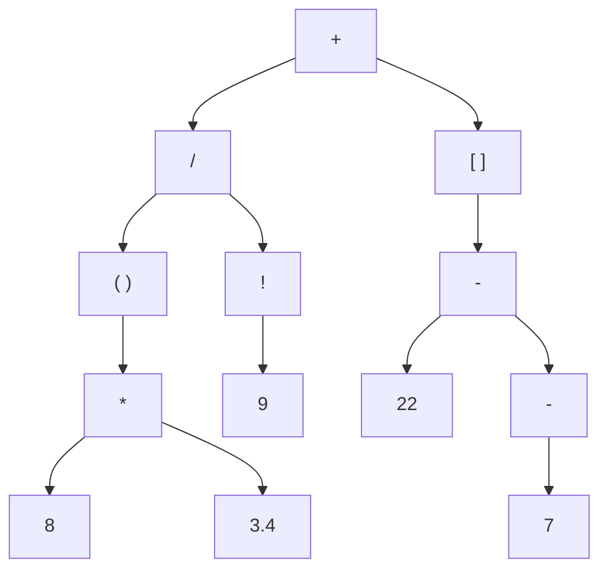

# Contents

- [Overview](#overview)
- [Build Instructions](#build-instructions)
- [Grammar](#grammar)
- [Implementation Details](#implementation-details)
    - [Tokens](#tokens)
    - [The Lexer](#lexer)
    - [Expressions](#expressions)
    - [The Parser](#parser)
    - [Error Handling](#error-handling)
    - [Logging](#logging)
- [TODO](#todo)

# Overview
This project implements an expression compiler using modern C++ features (C++20). Currently, the program is capable of the following:

- Tokenizing an input string supplied by either a file (`../data/code.txt` by default; change this location in `../src/settings.hpp`) or through macro expansion (modify `MANUAL_INPUT_STR` accordingly and set `INPUT_METHOD` to `MANUAL_INPUT` in `../src/main.cpp`).
- Producing an abstract syntax tree (AST) and printing its contents in normal Polish notation (NPN).

A multitude of test cases are included to verify subsystem functionality.

# Build Instructions
The build was tested on the LLVM (clang64) and GNU (ucrt64) toolchains under MSYS2.

## Requirements
The following software is required to successfully build the program:

- `VCPKG`
- `CMake`
- `Ninja` or `Make`

## Procedure
It is crucial to specify your toolchain file location and [triplets](https://learn.microsoft.com/en-us/vcpkg/concepts/triplets) before compiling, as `CMake` needs to know where and how to incorporate these environment factors into the build.

First, determine your host and target triplets. You can either select them from a preinstalled collection (located at `%VCPKG_ROOT%/triplets` and `%VCPKG_ROOT%/triplets/community`) or create your own, although instructions for this will not be provided.

Create your own `CMakeUserPresets.json` and place it in the root directory. Afterwards, send the triplet values to the `cacheVariables` field. Below is a sample file:

    // CMakeUserPresets.json
    {
        "version": 11,
        "configurePresets": [
            {
                "name": "debug",
                "inherits": [
                    "default"
                ],
                "generator": "Ninja",
                "cacheVariables": {
                    "VCPKG_HOST_TRIPLET": "x64-llvm-static",
                    "VCPKG_TARGET_TRIPLET": "x64-llvm-static"
                }
            }
        ]
    }
    
Note that `x64-llvm-static` is a custom triplet.

`CMAKE_TOOLCHAIN_FILE` is already set in `CMakePresets.json`, but you may want to change this according to the relative location of `vcpkg.cmake` and whether you have created the environment variable `VCPKG_ROOT`. By adding a unique field to `CMakeUserPresets.json` and using the corresponding preset, it will override the default value.

Following this, run the command:

    cmake --preset="<preset_name>"

where `<preset_name>` matches the value for a `"name"` field in either `CMakePresets.json` or your `CMakeUserPresets.json`. Using the example file above, `<preset_name>` should be `debug`.

Finally, build the project normally via:

    cmake --build build

Assuming you followed the steps correctly, you should have two executables in `../build/bin`. Run them as desired.

# Grammar
Valid input expressions abide by the following rules:

| Operator | Operation           | Precedence                       |
| -------- | ------------------- | -------------------------------- |
| +        | Addition            | Term                             |
| -        | Subtraction         | Term & Unary (Right Associative) |
| *        | Multiplication      | Factor                           |
| /        | Division            | Factor                           |
| !        | Factorial Expansion | Unary (Left Associative)         |

| Operand | Token Set / Example    | Precedence |
| ------- | ---------------------- | ---------- |
| Integer | 352                    | Primary    |
| Double  | 5.94                   | Primary    |
| Group   | '(', ')', '[', and ']' | Primary    |

## Precedence Ladder
1. Primary
2. Unary (Left Associative)
3. Unary (Right Associative)
4. Factor
5. Term
6. Expression

## Additional Rules
- Whitespace is ignored. However, tokens comprising multiple characters must not contain any.
- Valid double-precision tokens may start with or end with a separator, but they must contain at least one explicit digit and use exactly one separator.
- Numeric tokens must be separated by whitespace.
- Distribution without an explicit `*` is currently unsupported.

# Implementation Details
This section covers the main sections of the source code. Although it fails to analyze every function and statement, it underscores important design decisions and considerations that were ultimately used in the most recent commit.

## Tokens
Tokens are the fundamental unit for storing expression data in the compilation pipeline. By design, all `Token` instances have two populated fields: `type` (`Token::Type`) and `literal` (`Literal`). `Literal` is an aliased type:

    // Token.hpp
    using Literal = std::variant<char, int, double>;

`type` serves as the primary method for directing tokens inside the pipeline. When the active parser needs to match tokens at certain precedence levels or the lexer needs to distinguish between numeric types, it uses this field.

A few associated member functions are defined to extend the functionality of `Token` in certain contexts. The following methods will not be covered, as their declarations should suffice:

    // Token.hpp
    struct Token {
        ...

        struct ToString {
            static std::string Type(const Token::Type type);
        };

        explicit operator bool() const;
        bool operator==(const Token& other) const;
        friend std::ostream& operator<<(std::ostream& out, const Token& token);
        ...
    };

Most token implementations include an ancillary field: the lexeme. Lexemes serve to provide a textual representation of the data contained within literals. However, lexemes are redundant for this project, as the overloaded insertion operator (`<<`) already handles piping raw data to streams.

## Lexer
The lexer handles all tokenization. It is initialized by passing a value string (for unified control over move semantics and copy construction) or a path to the input file via `std::filesystem::path`.

The public interface exposes two useful methods: `tokenize` and `printTokens`. Both methods perform as expected, with the caveat that `tokenize` updates the state of the active `Lexer` object. Any attempts to print an empty lexer or one whose state is something other than `OKAY` will have no effect.

    // Lexer.hpp
    std::pair<std::vector<Token>, bool> tokenize();
    bool tokenize(std::vector<Token>& tokens);
    void printTokens(const std::vector<Token>& tokens, std::size_t right_just) const;

You can customize where the actual token values appear by varying the parameter `right_just`. Below is the console output of the input `( 8 * 3.4 ) / 9! + [ 22 - -7 ]` with `right_just = 30`:

    left parenthesis             (
    int                          8
    product                      *
    double                     3.4
    right parenthesis            )
    quotient                     /
    int                          9
    factorial                    !
    sum                          +
    left bracket                 [
    int                         22
    difference                   -
    difference                   -
    int                          7
    right bracket                ]

One should determine whether tokenizing an input was successful before feeding the output to a `Parser` instance. When the lexer encounters an unknown token type, it registers an `InvalidCharacter` error (see [Error Handling](#error-handling) for implementation details). This sets the lexer's state to `FAIL` and terminates processing, returning false.

The tokenization logic is rather straightforward. When a new token is first detected, the lexer attempts to deduce its type with a switch statement. Should the result be a complete type, the literal is assigned appropriately, and the token window `[m_start, m_current]` clamps to `[m_current, m_current]` to prepare the lexer for the next token. Whitespace is ignored at the callsite to simplify edge cases in the extraction logic.

Numbers are slightly more complex. The compiler supports both integers and double-precision numbers, so they must be differentiated. To accomplish this, the lexer begins by "reguessing" the token type from an incomplete guess.

    // Lexer.cpp
    Token Lexer::generateNumericToken(Token::Type init_guess) {
        Token::Type new_guess{ init_guess == Token::Type::__SEPARATOR ? Token::Type::DOUBLE : Token::Type::INT };
        ...
    }

If the current token began with a separator (`.`), we can immediately conclude that its final type must be `DOUBLE` under the assumption that the remainder of the token is uncorrupted. We check for corruption as we extract successive characters; any separators we encounter beyond the start of the token may only be consumed if the current type is `INT`. Encountering a separator while the current type is `DOUBLE` implies that one was already found, which suggests that the syntax is invalid.

`tokenize` returns either `std::pair<std::vector<Token>, bool>` or `bool` based upon where the user wishes to assign the result. The boolean indicates whether the operation was successful, irrespective of the overload.

## Expressions
Expression representation is realized through inheritance and the visitor pattern. `Binary`, `Unary`, `Primary` and `Grouping` all inherit from an abstract base `Expr` which provides both a structural framework for printing/evaluation and allows derived classes to be interpreted under a single class.

Within `Expr`, an abstract visitor class `Visitor` that consolidates visit methods is declared, through which derived classes print and evaluate their contents. This functionality is overridden by classes that inherit from visitor; passing these derived classes to overridden accept calls forwards execution to the passed visitor.

    // Expression.hpp
    class Expr {
    public:
        ...

        class Visitor {
        public:
            virtual void visit(Binary& binary) const = 0;
            ...
        };

        class Eval : public Visitor {
        public:
            void visit(Binary& binary) const override;
            ...
        };
        ...

        virtual ~Expr() = default;
        ...
    };

Specific expression types must befriend `Expr` to grant visitors access to their contents:

    class Binary : public Expr {
        friend class Expr;          // Critical as this allows visiting methods to access Binary's private members

    public:
        ...

        void accept(const Visitor& visitor) override;
        ...
    };

Note that it is vital to declare a virtual default destructor inside `Expr`, as you cannot delete a derived expression through the base. It must be `public` (not `protected`/`private`) to allow for explicit calls to `~Expr`.

One alternative to this approach uses `std::variant` to hold custom expression types, while runtime checks are performed on the active type and execution is forwarded to overloaded member functions. The inheritance model has little performance advantage over others and was chosen off of stylistic preference.

## Parser
The parser is currently the most sophisticated pipeline in the program. It converts a tokenized list into an abstract syntax tree (AST), which is in essence a hierarchical expression diagram where nodes represent operands (nonterminals) and leaves represent terminal expressions. This will be used in the actual compilation stage.

### Theory
ASTs represent order of operations by depth, as in the deeper the expression, the earlier its evaluation will commence. While this effect is just one byproduct of the data structure, it is important to see how this property arises.

Consider the following input:

    ( 8 * 3.4 ) / 9! + [ 22 - -7 ]

The parser iterates through a list of tokens&mdash;left to right&mdash; and constructs an AST using a predefined set of [grammar rules](#grammar). Here, the parser first recognizes a grouping token `(` and proceeds to construct a full expression within its body until it reaches the closing group character `)`; that expression would itself be a tree. In doing so, it encounters the literal `8` and attempts to identify the structure (binary, unary, etc.) corresponding to the operand `*` that follows. Once it successfully does, the subtree is formed, using the active expression `8` as the left-hand leaf, and subsequently extracting the right-hand leaf (expression) `3.4`, as `*` is binary.

A `/` is then found, signaling to the parser that another complete expression must exist to the right. Afterwards, it identifies a `9` and the factorial symbol `!`, which it knows to group together. This pattern continues until the parser either has iterated through the entire token list or can no longer grow the AST due to illegal syntax.

Below is a visual depiction of the AST's final underlying content post parsing:

Generally speaking, the more complex the expression, the deeper and more complex the resultant AST.

Notice how `/` branches into a grouped expression `()` and the result of a factorial. Both branches must be evaluated prior to dividing, as you cannot define division without representing a dividend and a divisor. Similarly, in the group branch, the product of `8` and `3.4` must be deduced before `()` can capture the subexpression in full. At the root (`+`), the left-hand quotient and the result of the grouped expression on the right must be available before one can compute the sum...

The main idea is that to perform an operation, all operand(s) must be complete, or fully evaluated. This contingency, supplemented by fixing the order in which precedence levels are matched, provides a way to algorithmically follow order of operations.

<blockquote>

The higher an operand's precedence, the earlier it is evaluated (e.g. multiplication has higher precedence than addition because products are generally computed before sums).

</blockquote>

### The Pipeline
Upon a call to `generateAST`, `Parser` will begin matching tokens at the lowest precedence level and climb up the ladder as it fails. Since expression currently matches everything, it immediately calls term, which then calls factor by requirement, and so forth.

    // Parser.hpp
    class Parser {
        ...
    private:
        ...

        std::unique_ptr<Expr> expression();
        std::unique_ptr<Expr> term();
        std::unique_ptr<Expr> factor();

        struct unary {
            static std::unique_ptr<Expr> right(Parser& parser);
            static std::unique_ptr<Expr> left(Parser& parser);
        };

        std::unique_ptr<Expr> primary();
        ...
    };

`unary` methods were consolidated under a static struct because they are closely bound in logic, associativity aside.

While most functions under `Parser` are rather self explanatory, the helper method `matchTokens` warrants further attention. Contrary to what one might assume, extraction (a read and advancement) is not guaranteed to occur here. It only transpires in the event the current token matches one of those inside in the `Token::Type` initializer list (aliased by `TokenTypes`)&mdash;this is imperative. Should `Parser` extract on every call to `matchTokens`, it would skip multiple operands when parsing either right-associative unary expressions or primary expressions, as both expression methods instantly acquire the current token in lieu of an expression of higher precedence beforehand:

    // Parser.cpp
    std::unique_ptr<Expr> Parser::unary::right(Parser& parser) {
        static constexpr TokenTypes types{ Token::Type::MINUS };

        // No call to unary::left first

        // Tokens are likely skipped HERE
        if (auto op{ parser.matchTokens(types) }) {
            ...
        }

        return unary::left(parser);
    }

Anything that fails to match on these calls will be skipped. Most arbitrary, nonconforming expressions will therefore be parsed erroneously, and in some edge cases, `nullptr` dereferencing may occur. It is hence critical to only advance upon a successful match.

Similar to `Lexer`, `Parser` maintains an internal state variable that knows whether any errors occurred. There are currently two ways to set its state to `FAIL`:

The first of which is by inputting an expression with invalid syntax. For example, using the binary operand "`+`" with only one terminal instead of two will cause the parser to fail and produce a similar error to what follows:

    Expected expression after '+'
    -----------------------------
    * At token instance: 1
    -----------------------------

This message not only tells us what token is missing an operand, but also which instance of that token raised the error and on which side the operand was expected. It translates to: "An expression was expected directly to the right of the first '`+`' found when reading the input from left to right."

One can trigger a similar error by feeding `Parser` an input with a missing operator, only in this case, the log hints at the token position where one should be. For input `1 6` (nontrivial whitespace), the position would be 2.

`Parser`'s error handling is centralized about "panic mode". All this means is that the parser will not stop detecting errors until one of the following occurs:

1. The internal iterator reaches the end of the input, or
2. An incomplete AST is generated (i.e. at least one expression is `nullptr`)

This allows the logger to illuminate multiple issues as opposed to just one. Since one can rectify numerous errors in a single run, the effort required to debug expressions is significantly reduced.

## Error Handling
There were two specific goals in mind while devising the design pattern for error handling:

1. Only allow certain classes (pipelines) to generate error messages for the global log.
2. Separate all error implementation from the class for which it is provided.

To accomplish this, an explicit template specialization (ETS) of `Error` is declared in the header file of each associated pipeline; their implementations are provided in dedicated files under `../src/errors`.

Additionally, a constraint is applied to all specializations that require the argument to inherit `Pipeline`. There is no restriction on access specifiers.

As a standard framework, `Error` implementations act as static classes. The intent is that an error message can be generated and logged from anywhere inside the implementation of the pipeline `T` that `Error<T>` augments. Furthermore, because data is passed at the callsite with respect to the information an individual error necessitates, there is no need for a singleton to hold pipeline instances.

It should also be noted that each member function ends with a call to a public error wrapper bound to `T`:

    // Pipeline.hpp
    class Pipeline {
    protected:
        ...

        virtual void ErrorWrapper(std::string_view start, std::function<std::string(Context)> func) = 0;
    };

    // Derived classes send ErrorWrapper to public scope

The wrapper demands two arguments: a message that is displayed before the error description (`start`) and a description generator (`func`). `func` is created at the callsite&mdash;within an `Error<T>` member&mdash;and is designed to return a description message generated with information provided by `Context`.

    // Pipeline.hpp
    using Content = std::variant<std::string_view, std::span<const Token>>;
    using Context = std::pair<Content, std::size_t>;

`Content` describes the underlying payload for a `Context` instance, which holds that payload and the position at which the error occurred.

It is also worthwhile to discuss why `std::span` is used as opposed to the container for which it exists.

`Context` originally accepted a pointer-to-const vector over a reference or shared pointer. This is in stark contrast to modern C++ (specifically C++14 onward) practices, which generally discourage the use of `T*` in favor of `T&` or smart pointers. However, `std::variant` is forbidden from holding reference types, and the constructors for smart pointers that accept an address are marked `explicit` (smart pointers are initialized by placing the raw address inside the constructor's argument list: `smart_ptr<T> ptr{ other_ptr }`. One may **not** implicitly cast a raw pointer to a smart pointer via move or copy assignments). Attempting to bypass the latter concern could raise various issues, including:

- Double frees, from multiple smart pointers independently owning the same data
- Stack deallocations, from passing an object that never demands heap memory

Enclosing the container within `std::reference_wrapper` was an alternative in mind, but introduced unnecessary verbosity. As an example, the snippet

    std::get<const std::vector<Token>*>(data.first)->begin()

became

    std::get<std::reference_wrapper<const std::vector<Token>>>(data.first).get().begin()

For these reasons, `std::span<const Token>` is the natural solution. It provides a non-owning view of the contents of `vector` (the underlying data's destructor is not called upon exiting the stack frame from which it originated) and prevents the user from calling `delete data.first;` despite the fact that no scenario here would warrant it.

These efforts ensure all error messages (that work for a specific pipeline) have a consistent structure. The wrapper can be customized per class, but must accept an initial message and a description generator because the origin specifies that `ErrorWrapper` is purely virtual.

One downside to this approach is the requirement that `ErrorWrapper` becomes public after it is inherited. A `Pipeline` `x` of type `T` calls `ErrorWrapper` inside of `Error<T>` via `x.ErrorWrapper(...)` to reduce the essential amount of code written, so it can technically be called wherever `T.hpp` is included. As with any other object-oriented design pattern, there always seems to be some limitation.

## Logging
The logger is a singleton class that consolidates all debug and error messages under one instance. It is used in the following manner:

    // Append an error message to the internal queue
    Log::instance().error(message);

    // ...do the same but with a debug message
    Log::instance().debug(message);

    // Dump either the error or debug queue (error queue takes precedence)
    Log::instance().dump();

    // Note: "message" has type std::string&&

Where exactly the logger is invoked is irrelevant. When the logger dumps its contents, it first checks whether the error queue is empty&mdash;the debug queue is dumped if this holds true; otherwise, the output stream will just be populated with errors.

The primary data structures associated with this class are unordered sets and queues, strictly for checking error message existence (to avoid holding duplicate error messages) and enforcing FIFO at the output. Messages are inserted as desired and popped upon a call to `dump` to limit memory usage. If the user wishes to preserve the output, it is (as of now) their responsibility to redirect it by passing output streams:

    // Log.hpp
    void dump(std::ostream& dos = std::cout, std::ostream& eos = std::cerr);

# TODO
- Generate the actual machine code (compilation)
- Convert the current file management (`#include`) into a module-based one
- Add variable assignment
    - Must modify logic for EOF errors in `Parser`
- Add a GUI (either using *imGUI* or from scratch with *OpenGL*)